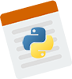

# PyNotepad
Notepad implementation with Python

This project is written with [PySide2](https://pypi.org/project/PySide2/).
This is for tutorials.

The icon is taken from [alienvalley.com](https://alienvalley.com) and edited by me.

Written with ♥ by Siavash Bamshadnia